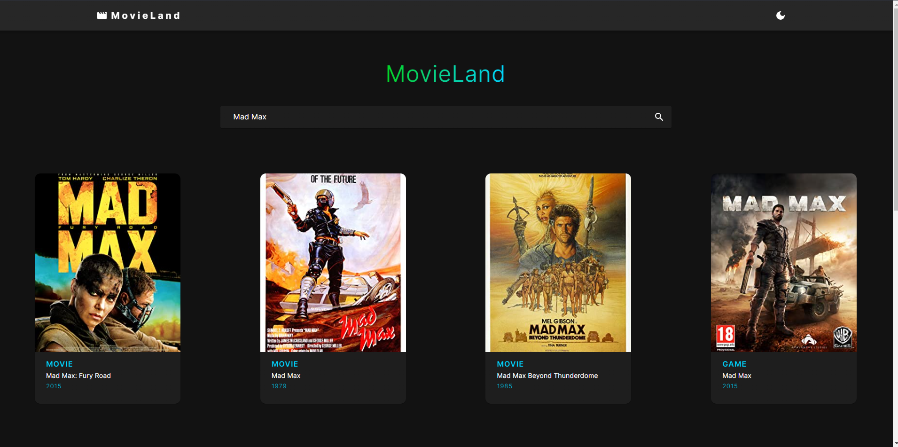

<h1 align="center">☀️ MovieLand</h1> Este é um projeto desenvolvido com a intenção de se aprender mais sobre React e API's, durante o desenvolvimento do projeto utilizei o framework CSS Material UI, usei os Hooks do React setState, useEffect para alterar alguns componentes dinâmicamente, o projeto consiste em uma busca por nome de filmes, jogos ou séries na API do OMDB, o site também contém Dark Mode.
  

<strong>A API só aceita consultas feitas escrevendo em inglês.</strong>

--- 

<h3>🦄 Autor</h3>

Augusto E.

